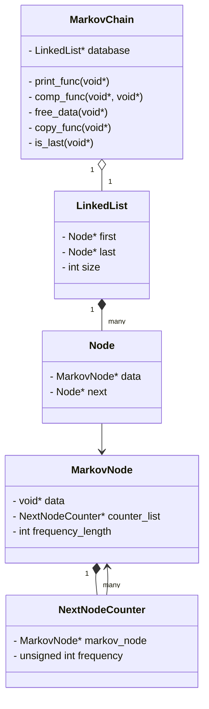
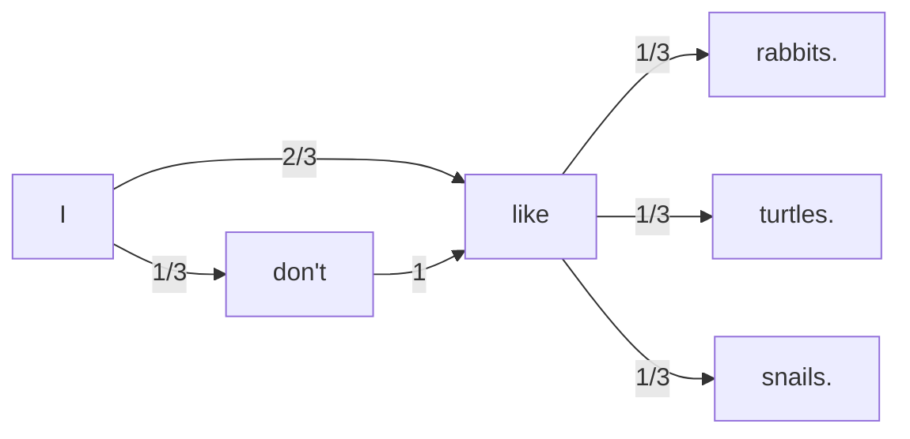

# Markov Chain Simulator  

## Table of Contents  
- Project Description  
- Features  
- UML  
- Process Flow  
- Extensions  
- Credits  
- Contact  

---

## Project Description  
The **Markov Chain Simulator** is a C project demonstrating how probabilistic models can be applied in different domains.  
It includes two applications built on top of a generic Markov Chain library:  

1. **Tweets Generator** – generates random tweets by learning from a text corpus and imitating word-to-word probabilities.  
2. **Snakes and Ladders** – simulates the classic 10×10 board game with dice rolls, snakes, and ladders, producing random walks.  

This project highlights concepts of dynamic memory management, generic programming, and probabilistic state transitions.  

---

## Features  
- Generic Markov Chain implementation supporting any data type.  
- Tweets Generator: natural-looking random sentences based on input text.  
- Snakes and Ladders: full simulation of game rules with random dice.  
- Modular design separating library logic from applications.  
- Memory-safe implementation with explicit allocation and deallocation.  

---

## UML  


---

## Process Flow  
### Random Sequence Generation  
```mermaid
flowchart LR
  A[Start] --> B{first_node ?}
  B -- no --> C[get_first_random_node()]
  B -- yes --> D[use first_node]
  C --> E[print(word)]
  D --> E[print(word)]
  E --> F{is_last(word) or max_length?}
  F -- yes --> G[End]
  F -- no --> H[get_next_random_node(word) \\ weighted by frequency]
  H --> E
```

### Example State Graph (Word Transitions)  


---

## Extensions  
- Higher-order Markov Chains for richer text generation.  
- Multiplayer Snakes and Ladders.  
- Visualization tools for tweets and board game paths.  
- Expand text generator to paragraphs or interactive dialogues.  

---

## Credits  
- Developed as part of the **Programming Workshop in C** course, Hebrew University of Jerusalem.  
- Thanks to the course staff for providing the framework and tests.  

---

## Contact  
- Author: Yuval Jacobs  
- Email: yuval.jacobs@example.com  
- LinkedIn: [Your LinkedIn Profile]  
